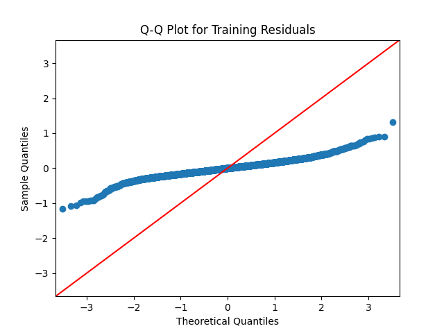

Sgcarmart Data Science Project

Project Overview: Analyzing the Used Car Market in Singapore

Objective:
In an effort to explore the used car market and identify affordable yet reliable options, a comprehensive data analysis was undertaken. 
Given the dynamic nature of the used car market in Singapore, no readily available datasets were found online. 
Consequently, data was scraped directly from sgcarmart.

Methodology:

Data Acquisition:
To scrape data from sgcarmart.com, a leading online marketplace for used cars in Singapore, the BeautifulSoup library (BS4) was employed for web-scraping due to its speed and reliability. 
The first 10000 car listings were targeted, and information was collected as of September 03, 2024.

The extracted information included the following:
Car Listing URL 'LISTING_URL', 
Car Brand and Model 'BRAND', 
Price 'PRICE', 
Depreciation Value Yearly 'DEPRE_VALUE_YEARLY', 
Registered Date 'REG_DATE', 
Mileage in KM 'MILEAGE_KM', 
Year of Manufacture 'MANUFACTURED_YEAR', 
Road Tax Yearly 'ROAD_TAX_YEARLY', 
Automatic or Manual Tranmission 'TRANSMISSION', 
Deregistration Value as of Web Scraping DTD 'DEREG_VALUE_FROM_SCRAPE_DATE', 
Web Scraping DTD 'SCRAPE_DATE', 
Open Market Value (OMV) 'OMV', 
Additional Registration Fee (ARF) 'ARF', 
Certificate of Entitlement (COE) from Web Scraping DTD 'COE_FROM_SCRAPE_DATE', 
Number of Days till COE Expires 'DAYS_OF_COE_LEFT', 
Engine Capacity in CC 'ENGINE_CAPACITY_CC', 
Car Curb Weight in KG 'CURB_WEIGHT_KG', 
Number of Past Owners 'NO_OF_OWNERS', 
Vehicle Type 'VEHICLE_TYPE'

This data was subsequently stored in a CSV file named sgcarmart_used_cars_prices.csv.

Data Cleaning and Preparation:

The raw data contained numerous null values, duplicated rows, and inconsistencies in data types. 
A thorough cleaning process was conducted to address these issues. 
Feature engineering was then applied to create new columns that would be beneficial for the analysis. 
The cleaned data was saved in a new CSV file named cleaned_cars.csv.

This structured approach ensures that the data is reliable and ready for further analysis to provide insights into the pricing and availability of various car brands in the used car market.

Summary from Linear Regression Models vs Random Forest Regression Models:
Linear Regression:
{'Summary': <class 'statsmodels.iolib.summary.Summary'>
"""
                            OLS Regression Results                            
==============================================================================
Dep. Variable:              PRICE_LOG   R-squared:                       0.881
Model:                            OLS   Adj. R-squared:                  0.881
Method:                 Least Squares   F-statistic:                     4849.
Date:                Thu, 19 Sep 2024   Prob (F-statistic):               0.00
Time:                        15:27:24   Log-Likelihood:                -281.00
No. Observations:                5888   AIC:                             582.0
Df Residuals:                    5878   BIC:                             648.8
Df Model:                           9                                         
Covariance Type:            nonrobust                                         
========================================================================================
                           coef    std err          t      P>|t|      [0.025      0.975]
----------------------------------------------------------------------------------------
const                   10.5439      0.069    153.635      0.000      10.409      10.678
MILEAGE_LOG             -0.0103      0.005     -1.903      0.057      -0.021       0.000
COE_FROM_SCRAPE_DATE -4.174e-06   2.01e-07    -20.811      0.000   -4.57e-06   -3.78e-06
DAYS_OF_COE_LEFT         0.0005    4.8e-06     98.634      0.000       0.000       0.000
CAR_AGE                 -0.0580      0.001    -45.842      0.000      -0.060      -0.056
ARF                   3.198e-06   7.24e-08     44.157      0.000    3.06e-06    3.34e-06
ENGINE_CAPACITY_CC       0.0001   8.41e-06     13.376      0.000     9.6e-05       0.000
CURB_WEIGHT_KG           0.0005   1.74e-05     31.534      0.000       0.001       0.001
NO_OF_OWNERS             0.0096      0.003      2.844      0.004       0.003       0.016
TRANSMISSION            -0.4306      0.031    -13.730      0.000      -0.492      -0.369
==============================================================================
Omnibus:                     1081.956   Durbin-Watson:                   2.013
Prob(Omnibus):                  0.000   Jarque-Bera (JB):            24608.084
Skew:                          -0.223   Prob(JB):                         0.00
Kurtosis:                      13.005   Cond. No.                     2.04e+06
==============================================================================

Notes:
[1] Standard Errors assume that the covariance matrix of the errors is correctly specified.
[2] The condition number is large, 2.04e+06. This might indicate that there are
strong multicollinearity or other numerical problems.
""", 'MAE': 0.18064257455042634, 'MSE': 0.0644136544628047, 'RMSE': 0.25379845244367566}

Random Forest Regression:
{'R^2': 0.9956936425419636, 'MAE': 0.031516998012555295, 'MSE': 0.002336680642302958, 'RMSE': 0.04833922467627049}

Summary from Random Forest Regression Models vs Gradient Boosting Regression Models:
Random Forest Regression:
Training R^2: 0.9349787751992766
Training MAE: 0.1383459211659664
Training MSE: 0.035115221500906624
Training RMSE: 0.18739055872937307

Testing R^2: 0.9120014085092089
Testing MAE: 0.155792435996898
Testing MSE: 0.04863509717418254
Testing RMSE: 0.22053366449180165

 
 

Gradient Boosting Regression:
Training R^2: 0.9914784674106109
Training MAE: 0.05201313094484405
Training MSE: 0.0046021203894680476
Training RMSE: 0.06783892974884

Testing R^2: 0.965476320646119
Testing MAE: 0.09019939850663643
Testing MSE: 0.01908056108332179
Testing RMSE: 0.13813240417556552

 
 